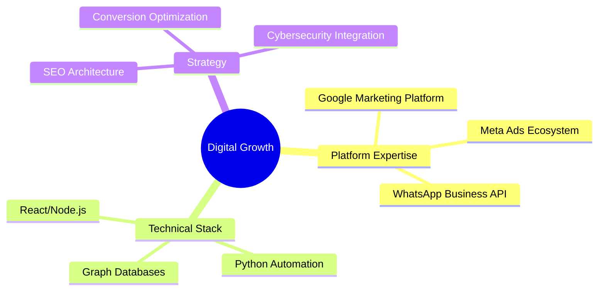
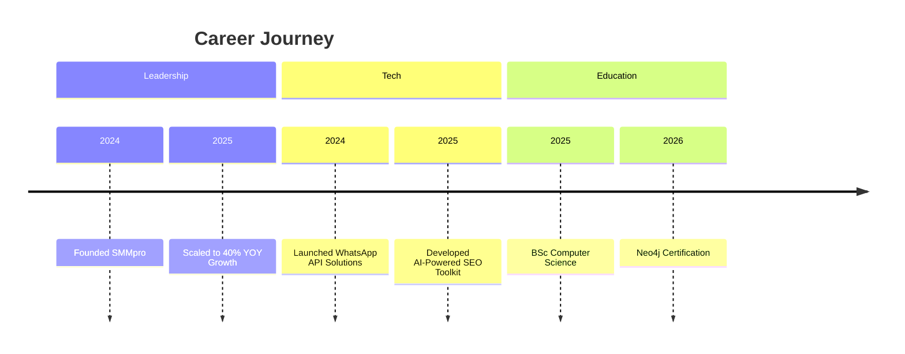

<div align="center">
  
  <h1>Ahmad Dilshad</h1>
  
[](https://facebook.com/SMMProOfficial)
[](https://github.com/syed-ahmad-dilshad)

</div>

## 🚀 Executive Summary

**Founder & CEO @ [SMMpro](https://smmpro.pk)**  
*Digital Growth Architect | Full-Stack Marketing Technologist*

```text
🌐 Digital Transformation Leader | 📈 40% YOY Growth Architect
💡 Tech Stack Innovator | 🤝 150+ Client Success Stories
📱 WhatsApp API Pioneer | 🔐 Cybersecurity Advocate
```

---

## 🔗 Connect With Me

<div align="center">
  
[](https://www.linkedin.com/in/syed-ahmad-dilshad)
[](mailto:support@smmpro.pk)
[](https://wa.me/923116100629)
[](https://smmpro.pk)

</div>

---

## 🛠️ Core Competencies

<div align="center">



</div>

---

## 🏅 Key Achievements

<div class="grid cards" align="center">

|  |  |  |
|-------------------------------------------------------------------------------------------|---------------------------------------------------------------------------------------------|-----------------------------------------------------------------------------------------------|

</div>

---

## 📈 GitHub Analytics

<div align="center">

[](https://github.com/syed-ahmad-dilshad)
[](https://github.com/syed-ahmad-dilshad)
[](https://git.io/streak-stats)

</div>

---

## 🏢 Professional Timeline



---

## 📦 Featured Projects

<div class="grid cards" align="center">

| [](https://github.com/syed-ahmad-dilshad/smmpro-core) | [](https://github.com/syed-ahmad-dilshad/seo-toolkit) | [](https://github.com/syed-ahmad-dilshad/whatsapp-business-api) |
|---------------------------------------------------------------------------------------------------------------------------------------------------------|---------------------------------------------------------------------------------------------------------------------------------------------------|------------------------------------------------------------------------------------------------------------------------------------------------------------------------|
| Enterprise Marketing Platform                                                                                                                           | AI-Driven SEO Optimization                                                                                                                       | Business Messaging Automation                                                                                                                                          |

</div>

---

## 📚 Continuous Learning

<div align="center">

|  |  |  |
|------------------------------------------------------------------------------------------------------|----------------------------------------------------------------------------------------------------------|--------------------------------------------------------------------------------------------------|

</div>

---

## 📍 Operational Hub

```geojson
{
  "type": "Feature",
  "geometry": {
    "type": "Point",
    "coordinates": [71.5249, 30.1575]
  },
  "properties": {
    "name": "SMMpro HQ",
    "address": "Basti Haji Block P/O Ismailabad, Multan",
    "contact": "+92 311 6100629"
  }
}
```

---

<div align="center">
  
[](https://visitorbadge.io/status?path=https%3A%2F%2Fgithub.com%2Fsyed-ahmad-dilshad)
[](https://github.com/syed-ahmad-dilshad?tab=repositories)
[](https://github.com/syed-ahmad-dilshad?tab=stars)
[](https://github.com/syed-ahmad-dilshad?tab=followers)
  
</div>
